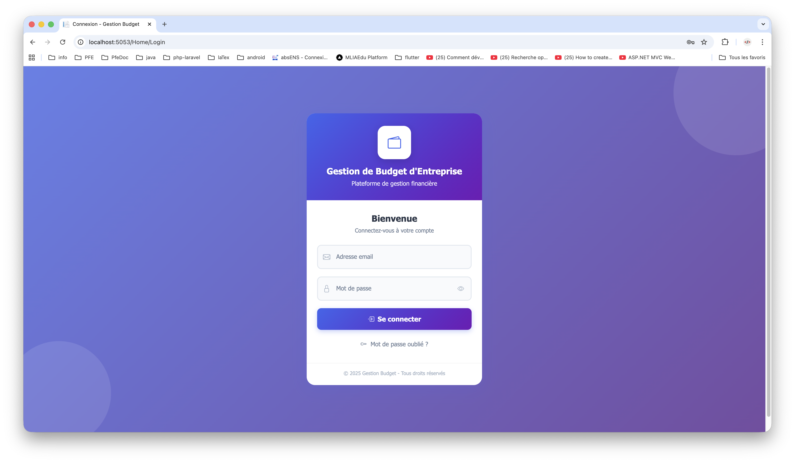
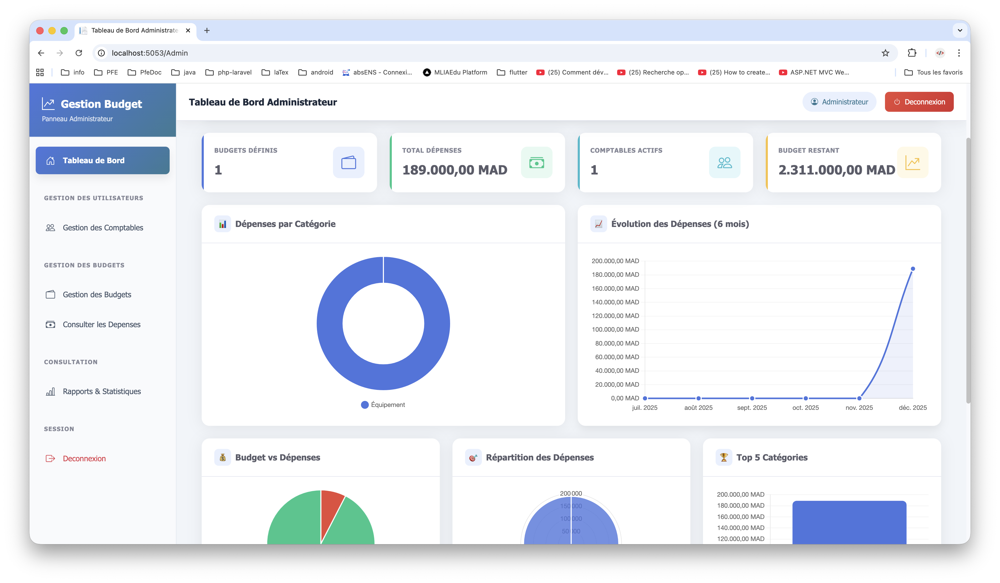
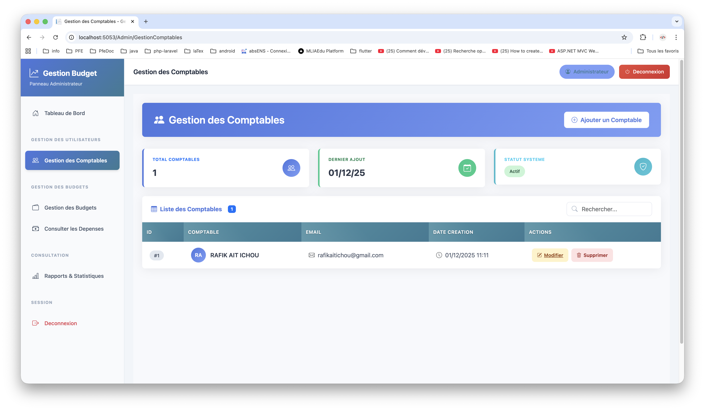
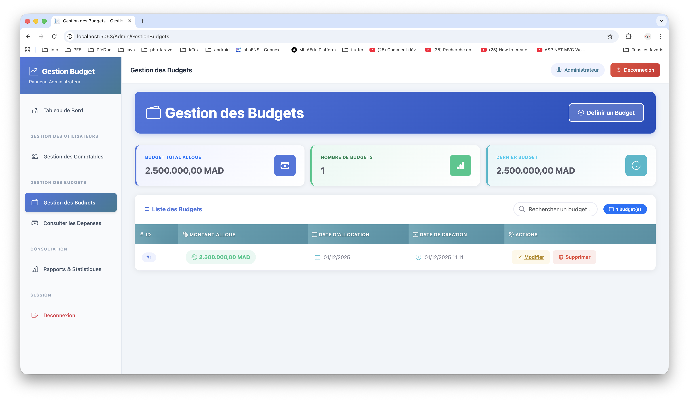
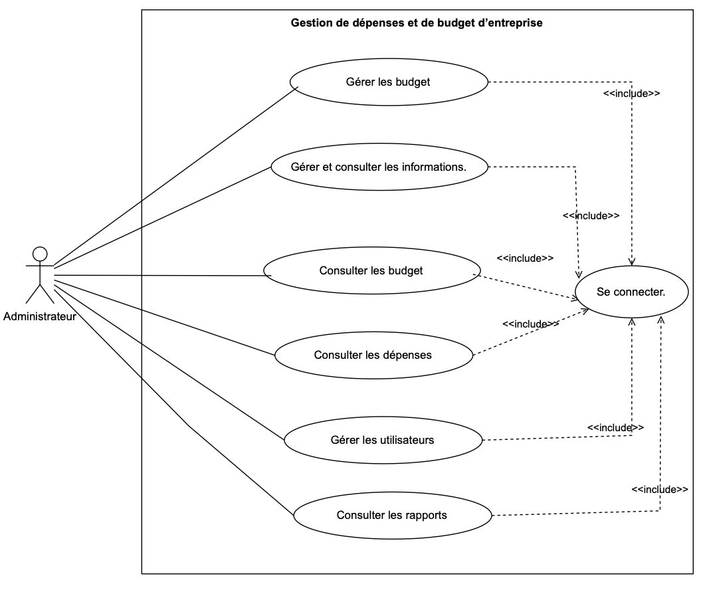
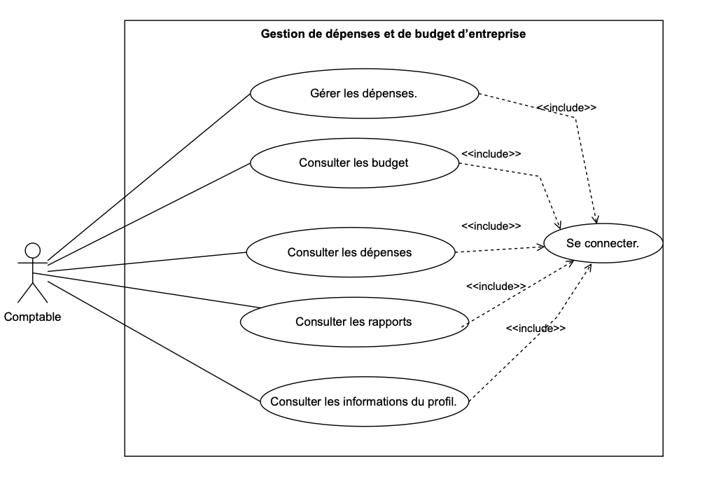

# Gestion Budget d'Entreprise

## 📋 Contexte

Gestion Budget d'Entreprise est une application web développée pour aider les entreprises à gérer efficacement leurs budgets, suivre leurs dépenses, et permettre une collaboration optimale entre les administrateurs et les comptables.

Avec la digitalisation croissante des processus financiers, les entreprises ont besoin d'outils modernes pour remplacer les systèmes de gestion manuelle obsolètes. Cette application répond à ce besoin en offrant une plateforme centralisée pour la gestion budgétaire.

## 🎯 Problématique

Les entreprises rencontrent plusieurs défis dans la gestion de leurs finances :

* **Systèmes manuels** : Utilisation de feuilles Excel et de papier
* **Manque de visibilité** : Difficulté à suivre les dépenses en temps réel
* **Collaboration limitée** : Communication inefficace entre les départements
* **Absence de rapports** : Pas d'analyses automatiques des données financières
* **Risques d'erreurs** : Erreurs humaines dans les calculs manuels

## 🎯 Objectifs

### Objectif Principal

Développer une application web de gestion budgétaire permettant aux entreprises de suivre et contrôler efficacement leurs finances.

### Objectifs Spécifiques

* **Centralisation des données** : Un seul système pour toute la gestion financière
* **Suivi en temps réel** : Visualisation instantanée des dépenses et budgets
* **Collaboration améliorée** : Interface distincte pour administrateurs et comptables
* **Sécurité renforcée** : Authentification sécurisée et protection des données
* **Rapports automatisés** : Génération automatique de rapports et statistiques
* **Accessibilité** : Interface responsive accessible depuis tout appareil

## 🛠 Technologies Utilisées

### Frontend

| Technologie       | Version | Rôle                      |
| ----------------- | ------- | ------------------------- |
| HTML5             | -       | Structure des pages       |
| CSS3              | -       | Style et mise en page     |
| Bootstrap         | 5.3.2   | Framework CSS responsive  |
| Bootstrap Icons   | 1.11.1  | Icônes modernes           |
| JavaScript (ES6+) | -       | Interactivité côté client |

### Backend

| Technologie                      | Version | Rôle                        |
| -------------------------------- | ------- | --------------------------- |
| ASP.NET Core                     | 10.0     | Framework principal         |
| C#                               | 14.0    | Langage de programmation    |
| Entity Framework Core            | 10.0     | ORM pour la base de données |
| Pomelo.EntityFrameworkCore.MySql | 9.0     | Provider MySQL              |
| BCrypt.Net-Next                  | 4.0.3   | Hachage sécurisé            |

### Base de Données

| Technologie     | Version | Rôle                                  |
| --------------- | ------- | ------------------------------------- |
| MySQL           | 8.0+    | Système de gestion de base de données | 

### Outils de Développement

| Outil                   | Rôle                 |
| ----------------------- | -------------------- |
| Visual Studio / VS Code | IDE de développement |
| Git                     | Contrôle de version  |
| dotnet CLI              | Outils .NET          |
| Postman                 | Tests d'API          |

## 🗄️ Base de Données

### Schéma de la Base de Données

```sql
CREATE DATABASE gestion_budget_entreprise_v2
CHARACTER SET utf8mb4
COLLATE utf8mb4_unicode_ci;
```

### Tables Principales

#### 1. Administrateurs

```sql
CREATE TABLE Administrateurs (
    Id INT PRIMARY KEY AUTO_INCREMENT,
    Nom VARCHAR(50) NOT NULL,
    Prenom VARCHAR(50) NOT NULL,
    Email VARCHAR(100) NOT NULL UNIQUE,
    MotDePasse VARCHAR(255) NOT NULL,
    DateCreation DATETIME DEFAULT CURRENT_TIMESTAMP
);
```

#### 2. Comptables

```sql
CREATE TABLE Comptables (
    Id INT PRIMARY KEY AUTO_INCREMENT,
    Nom VARCHAR(50) NOT NULL,
    Prenom VARCHAR(50) NOT NULL,
    Email VARCHAR(100) NOT NULL UNIQUE,
    MotDePasse VARCHAR(255) NOT NULL,
    DateCreation DATETIME DEFAULT CURRENT_TIMESTAMP
);
```

#### 3. Budgets

```sql
CREATE TABLE Budgets (
    Id_budget INT PRIMARY KEY AUTO_INCREMENT,
    Montant_alloue DECIMAL(15,2) NOT NULL,
    Date_alloue DATE NOT NULL,
    DateCreation DATETIME DEFAULT CURRENT_TIMESTAMP
);
```

#### 4. Dépenses

```sql
CREATE TABLE Depenses (
    Id_depense INT PRIMARY KEY AUTO_INCREMENT,
    Categorie VARCHAR(50) NOT NULL,
    Description TEXT,
    Montant DECIMAL(10,2) NOT NULL,
    Date_depense DATE NOT NULL,
    DateCreation DATETIME DEFAULT CURRENT_TIMESTAMP
);
```

#### 5. Rapports

```sql
CREATE TABLE Rapports (
    Id INT PRIMARY KEY AUTO_INCREMENT,
    Titre VARCHAR(100) NOT NULL,
    Contenu TEXT,
    DateCreation DATETIME DEFAULT CURRENT_TIMESTAMP
);
```

## 🚀 Commandes pour la Première Installation

### Prérequis

* .NET SDK 10.0
* MySQL Server 8.0+
* Git

### 1. Cloner le projet

```bash
git clone https://github.com/RAFIKAITICHOU/gestion-de-d-penses-et-de-budget-d-entreprise.git
cd GestionBudget_V2
```

### 2. Configurer l'application (`appsettings.json`)

```json
{
  "ConnectionStrings": {
    "DefaultConnection": "server=localhost;port=3306;database=gestionbudget;user=root;password=VOTRE_MOT_DE_PASSE;CharSet=utf8mb4"
  },
  "Logging": {
    "LogLevel": {
      "Default": "Information",
      "Microsoft.AspNetCore": "Warning"
    }
  },
  "AllowedHosts": "*"
}
```

### 4. Installer les dépendances

```bash
dotnet restore
dotnet tool install --global dotnet-ef
```

### 5. Appliquer les migrations

```bash
dotnet ef migrations add InitialCreate
dotnet ef database update
```

### 6. Lancer l'application

```bash
dotnet run
```

### 7. Accéder à l'application
💡 Remarque : Les ports peuvent varier selon votre configuration. Par défaut, ASP.NET Core utilise généralement 5000 pour HTTP et 5001 pour HTTPS, mais votre application peut démarrer sur d'autres ports si ceux-ci sont déjà utilisés.

* [https://localhost:5001](https://localhost:5001)
* [http://localhost:5000](http://localhost:5000)

### 8. Comptes de test

**Admin**

* Email : [admin@entreprise.com](mailto:admin@entreprise.com)
* Mot de passe : admin123

## 🔧 Fonctionnalités par Rôle

### Administrateur

* Gestion des comptables (CRUD)
* Gestion des budgets
* Tableaux de bord
* Rapports, export CSV/PDF

### Comptable

* Gestion des dépenses
* Historique
* Export des données

## 🖼️ Captures d’Écran

Voici quelques aperçus de l’application :

### 📌 Page d’accueil


### 📌 Tableau de bord Administrateur


### 📌 Gestion des Comptables


### 📌 Gestion des Dépenses (Comptable)


---
## 🧠 Diagrammes UML

### 📘 Diagramme de Cas d’Utilisation (Use Case)
Voici le diagramme UML représentant les interactions principales entre les acteurs et le système :




---

### 📗 Diagramme de Classe
Ce diagramme montre la structure des entités principales du projet :


---

> 📁 **Note :** Place les images UML dans un dossier `uml/` à la racine de ton projet GitHub.


## 📁 Structure du Projet

```
GestionBudget_V2/
├── Controllers/
├── Models/
├── Views/
├── Data/
├── Services/
├── Utils/
├── wwwroot/
├── Program.cs
└── appsettings.json
```

## 🧪 Tests

```bash
dotnet test
```

## 🔒 Sécurité

* Sessions sécurisées
* Hachage BCrypt
* Validation des entrées
* HTTPS

## 📝 Journal des Versions

### v1.0.0

* Gestion des budgets
* Dépenses
* Tableaux de bord
* Authentification

## 🤝 Contribution

1. Fork
2. Branch
3. Commit
4. Pull Request

## 📄 Licence

Licence MIT

## 👥 Auteurs

AIT ICHOU RAFIK

## 🙏 Remerciements

Équipe de développement, communauté .NET, contributeurs.

Dernière mise à jour : Novembre 2025


